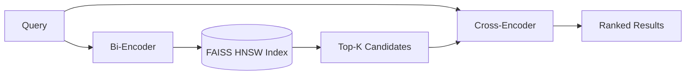

# Two-Stage-Semantic-Retrieval

[](https://www.python.org/)
[](https://pytorch.org/)
[](LICENSE)

一个结合 BERT 双编码器召回、FAISS 向量检索和 ModernBERT 交叉编码器重排的两阶段语义检索系统。第一阶段使用 Bi-Encoder 和 FAISS
从语料库中快速召回候选文档，第二阶段使用 Cross-Encoder 计算更细粒度的
query-passage 相关性并重新排序。

本项目以 MS MARCO 为训练数据，包含召回模型微调、重排模型训练、NanoBEIR
评估以及 Simple English Wikipedia 检索流程。仓库只保存可复现的源代码；
数据集、模型权重、缓存和向量索引均在本地生成，不提交到 Git。

## 检索流程



- **召回阶段**：共享 BERT 编码器，masked mean pooling，向量 L2 归一化，
  使用 batch negatives 训练。
- **索引阶段**：使用 FAISS HNSW 近似最近邻索引和内积相似度。
- **重排阶段**：Cross-Encoder 联合编码 query-passage，以 BCE 目标训练相关性分数。
- **评估阶段**：在 NanoBEIR 子集上报告 MAP、MRR@10 和 NDCG@10。

## 项目结构

```text
.
├── recall/
│   ├── finetune.py          # MS MARCO Bi-Encoder 训练入口
│   └── recall_model.py      # 召回模型与 batch-negative loss
├── rank/
│   ├── train.py             # Cross-Encoder 训练入口
│   ├── model.py             # 重排模型
│   ├── trainer.py           # BCE 训练、评估和 checkpoint 管理
│   ├── evaluation.py        # NanoBEIR 数据准备与排序指标
│   └── data.py              # 长度感知的 batching sampler
├── search_system/
│   ├── search.py            # 索引构建与两阶段检索入口
│   ├── recall_model.py      # 推理侧召回模型
│   └── model.py             # 推理侧重排模型
├── requirements.txt
└── LICENSE
```

## 环境准备

推荐使用 Python 3.10 或 3.11，并为训练任务准备支持 CUDA 的 GPU。

```bash
python -m venv .venv

# Linux / macOS
source .venv/bin/activate

# Windows PowerShell
.venv\Scripts\Activate.ps1

python -m pip install --upgrade pip
pip install -r requirements.txt
```

`requirements.txt` 默认安装 PyPI 提供的 PyTorch。需要特定 CUDA 版本时，请先按
[PyTorch 官方安装说明](https://pytorch.org/get-started/locally/)安装对应版本，再安装其余依赖。

## 使用方法

以下命令均在项目根目录执行。

### 1. 训练召回模型

```bash
python recall/finetune.py --model_name bert-base-uncased --train_batch_size 64 --epochs 3
```

脚本会下载 MS MARCO collection、queries 和 hard negatives，输出模型到
`recall/output/`。完整数据体积较大，首次运行需要稳定网络和足够磁盘空间。

### 2. 训练重排模型

```bash
python rank/train.py --model-name-or-path answerdotai/ModernBERT-base --epochs 3 --train-batch-size 4
```

训练数据来自 `microsoft/ms_marco`，评估使用 NanoBEIR 的 MSMARCO、NFCorpus
和 NQ 子集。checkpoint 默认保存到 `rank/models/`。

### 3. 运行两阶段检索

训练完成后，将下面两个路径替换为实际输出目录：

```bash
python search_system/search.py --query "What is the capital of the United States?" --recall-model recall/output/RUN_NAME/epoch_3 --reranker-base-model answerdotai/ModernBERT-base --reranker-checkpoint rank/models/reranker-msmarco-v1.1-ModernBERT-base-bce/checkpoint-best
```

第一次运行会下载 Simple English Wikipedia 语料并构建 FAISS 索引，随后复用
`search_system/` 中的本地缓存。模型权重和索引不会被 Git 跟踪。

常用检索参数：

```text
--top-k       召回后送入重排器的候选数量，默认 8
--device      auto、cpu、cuda 或具体设备（例如 cuda:0）
--cache-dir   Wikipedia 语料、passages 和 FAISS 索引的保存目录
```

## 示例结果

使用本地训练权重和 169,597 条 SimpleWiki passages 进行检索：

```text
Query: What is the capital of the United States?

Top reranked result (score: 0.470):
Washington, D.C. ... is the capital of the United States.
```

该示例展示了召回器先从索引中筛选候选，再由重排器将直接回答问题的 passage
提升到首位。分数会随训练权重、随机种子和依赖版本发生变化。

## 数据与模型来源

- 召回训练数据：[MS MARCO Passage Ranking](https://microsoft.github.io/msmarco/)
- 召回基础模型：[bert-base-uncased](https://huggingface.co/google-bert/bert-base-uncased)
- 重排基础模型：[ModernBERT-base](https://huggingface.co/answerdotai/ModernBERT-base)
- 重排评估数据：[NanoBEIR](https://huggingface.co/datasets/sentence-transformers/NanoBEIR-en)
- 检索演示语料：Simple English Wikipedia (2020-11-01)

使用这些数据和模型时，请同时遵守各自的许可证与使用条款。

## 设计说明

当前实现用于学习和实验，尚未封装为在线服务。大规模或生产环境可继续增加配置管理、
混合精度训练、分布式编码、离线指标记录和服务化接口。

## License

本项目采用 [MIT License](LICENSE)。数据集和预训练模型遵循其原始许可证。
